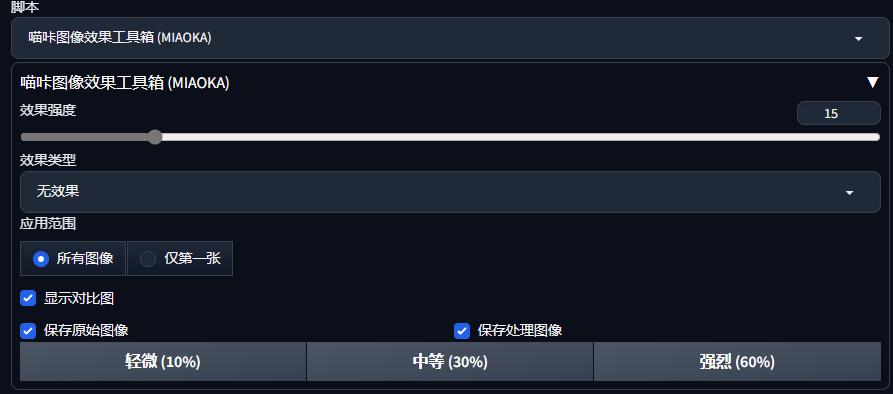

# 喵咔图像效果工具箱 (MIAOKA)

一个适用于 AUTOMATIC1111 WebUI 的扩展，提供多种图像后处理效果，包括噪点、模糊、滤镜等，支持对比图、强度调节、以及 txt2img 和 img2img 双模式使用。

---

- ✍️ Author 作者: MIAOKA  
- 📦 Version 版本: 1.3  
- 🧪 Features 特性:
  - 支持17种图像效果（高斯噪点、椒盐噪点、均匀噪点、斑点噪点、高斯模糊、运动模糊、锐化、边缘检测、油画效果、铅笔画、怀旧棕调、反色、像素化、雨滴效果、胶片颗粒、素描效果）
  - 可调效果强度（0%–100%）
  - txt2img 和 img2img 通用
  - 支持保存原图、处理后的图像、对比图
  - 图像按时间戳命名，避免覆盖
  - 预设强度按钮（轻微、中等、强烈）
- ❗ License 许可: 非商业用途，仅供学习研究，转载请注明作者

---

## 🔄 更名公告 | Rename Notice

原扩展名 "Add Noise to Output (by MIAOKA)" 已正式更名为 **喵咔图像效果工具箱 (MIAOKA)**，以更好地反映扩展功能的全面升级。本次更新从单一噪点功能扩展为完整的图像效果工具箱，提供17种专业图像处理效果。

---

## 🆕 更新公告 | Update Log

### 版本 1.3 主要更新：
1. **功能扩展**：从5种噪点效果扩展为17种图像处理效果
2. **新增滤镜**：包括模糊、锐化、边缘检测、油画效果、铅笔画等专业图像处理
3. **效果强度控制**：0-100%精确调节效果强度
4. **对比图功能**：直观展示处理前后效果对比
5. **预设强度按钮**：快速应用轻微/中等/强烈效果
6. **保存选项**：可选择保存原始图像和处理后图像
7. **应用范围控制**：可选择应用于所有图像或仅第一张
8. **优化错误处理**：更完善的错误处理和日志系统

---

## 🧠 简介 | Introduction

本扩展为生成的图像添加多种后处理效果，以增强视觉风格。无需重新训练模型，即可模拟各种艺术效果。

Now you can apply various artistic effects to your generated images **without retraining your model**.

---

## 🚀 安装方法 | Installation

将本扩展克隆或复制到你的 WebUI 目录的 `extensions/` 文件夹中：


cd stable-diffusion-webui/extensions
git clone https://github.com/sssyyyfff/miaoka_image_effects.git

重启 WebUI 即可。

注意：部分效果需要OpenCV。如果未安装，请手动安装OpenCV：

pip install opencv-python-headless

---

🛠 使用方法 | How to Use
进入 txt2img 或 img2img 页面

在底部"Scripts"下拉中选择 喵咔图像效果工具箱 (MIAOKA)

设置：

效果类型（17种可选）

效果强度（0~100%）

应用范围（所有图像或仅第一张）

是否显示对比图

是否保存原始图像

是否保存处理后的图像

使用预设强度按钮快速设置

点击生成！

🎨 支持的效果类型（Effect Types）
|中文名称	       |英文名称	          |说明（中/英）                                             |
|------------------|------------------|--------------------------------------------------------|
| 高斯噪点         | Gaussian          | 模拟真实感光随机扰动 / Simulates random sensor noise |
| 椒盐噪点         |	Salt and Pepper	白点黑点干扰 / Adds black-and-white speckles               |
| 均匀噪点         |	Uniform Noise	均匀浮动 / Uniform random distortion               |
| 斑点噪点         |	Speckle Noise	图像乘噪点叠加 / Image * noise variation               |
| 高斯模糊         |	Gaussian Blur	柔化图像 / Softens the image               |
| 运动模糊         |	Motion Blur	模拟运动轨迹 / Simulates motion               |
| 锐化	          |Sharpen	增强边缘 / Enhances edges                              |
| 边缘检测         |	Edge Detection	提取边缘 / Extracts edges            |
| 油画效果         |	Oil Painting	模拟油画笔触 / Simulates oil painting strokes               |
| 铅笔画	          |Pencil Sketch	铅笔画效果 / Pencil drawing effect               |
| 怀旧棕调         |	Sepia	老照片棕褐色调 / Old photo sepia tone               |
| 反色	          |Invert	颜色反转 / Inverts colors               |
| 像素化	          |Pixelate	像素块效果 / Pixel blocks effect               |
| 雨滴效果         |	Rain Effect	模拟雨滴 / Simulates raindrops               |
| 胶片颗粒         |	Film Grain	模拟胶片颗粒 / Simulates film grain               |
| 素描效果         |	Sketch	素描画效果 / Sketch effect               |
| 无效果	          |None	无效果 / No effect               |
```
📁 图像保存位置
所有图像保存于对应子文件夹中：

```
outputs/txt2img-images/<任务文件夹>/original/   # 原始图像
outputs/txt2img-images/<任务文件夹>/processed/ # 处理后的图像
```
文件名自动附加时间戳，避免被覆盖。

### 原始图像 vs 加噪图像（30%）


---
## 🖼 界面预览（UI Preview）



---

## 📄 许可证 | License

版权所有 © MIAOKA  
本项目仅供学习研究用途，**禁止用于商业用途**。如需转载或修改，请保留作者信息。  
This project is for **non-commercial research and learning only**. Please retain author attribution if redistributed or modified.

---

## ⭐ 鼓励支持

如果你觉得这个项目有用，欢迎点赞支持，或将其推荐给其他使用 A1111 WebUI 的朋友们！

If you find this helpful, give it a ⭐ on GitHub and share it with fellow creators!