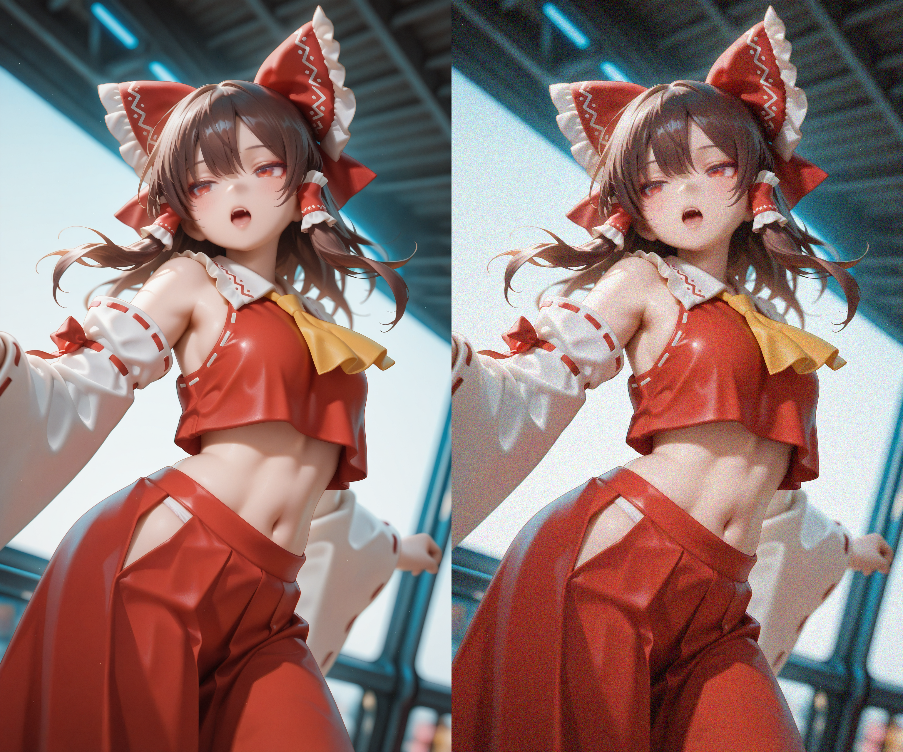
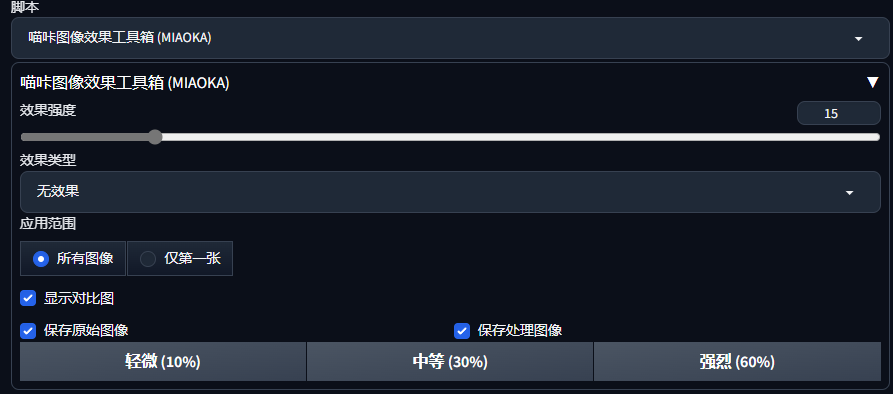

# Add Noise to Output (by MIAOKA)

An extension for AUTOMATIC1111 / Forge Classic Neo that applies customizable image effects after generation.  
Now supports **5 types of noise**, **comparison image preview**, and **txt2img / img2img modes**.

一个适用于 AUTOMATIC1111 与 Forge Classic / Neo 的图像后处理扩展。支持多种效果、强度调节、对比图、原图/处理图保存，以及 txt2img / img2img。

---

- ✍️ Author 作者: MIAOKA  
- 📦 Version 版本: 1.5  
- 🧪 Features 特性:
  - 添加多种噪点类型（高斯、椒盐、泊松、均匀、斑点）
  - 可调噪点强度（1%–100%）
  - txt2img 和 img2img 通用
  - 支持保存原图、噪声图、对比图
  - 图像按时间戳命名，避免覆盖
- ❗ License 许可: 非商业用途，仅供学习研究，转载请注明作者

---

## 🆕 Forge Classic / Neo 支持

1.5.1 版本增加 Forge Classic / Neo 兼容模式。

- AUTOMATIC1111：继续使用原来的 Scripts 下拉菜单和 `run()` 流程。
- Forge Classic / Neo：自动切换为 AlwaysVisible + `postprocess()` 后处理流程。
- Neo 模式不会在插件内部再次调用 `process_images()`，避免重复进入生成流程。
- 原有 17 种图像效果、强度、应用范围、对比图和保存功能保持不变。

## 🧠 简介 | Introduction

众所周知，Dogma 风格图像常带有一定的噪点感。在训练模型时直接添加噪点容易污染数据，因此更推荐使用“后处理方式”来增强视觉风格。

本脚本正是为此目的开发 —— 生成图像后，通过后处理形式**非破坏性地添加噪点效果**，并提供多种噪点风格和强度选项。

Now you can simulate film grain, corrupted textures, or stylized roughness **without retraining your model**.

---

## 🚀 安装方法 | Installation

将本扩展克隆或复制到你的 WebUI 目录的 `extensions/` 文件夹中：

```bash
cd stable-diffusion-webui/extensions
git clone https://github.com/sssyyyfff/sd_add_noise.git
```

重启 WebUI 即可。

---

## 🛠 使用方法 | How to Use

1. 进入 `txt2img` 或 `img2img` 页面  
2. 在底部“Scripts”下拉中选择 `Add Noise to Output (by MIAOKA)`  
3. 设置：
   - 噪点类型（5种可选）
   - 噪点强度（建议 5~15% 为自然颗粒感）
   - 是否只对第一张添加、是否显示对比图
4. 点击生成！

---

## 🎨 支持的噪点类型（Noise Types）

| 中文名称         | 英文名称         | 说明（中/英）                                           |
|------------------|------------------|--------------------------------------------------------|
| 高斯噪点         | Gaussian          | 模拟真实感光随机扰动 / Simulates random sensor noise  |
| 椒盐噪点         | Salt and Pepper   | 白点黑点干扰 / Adds black-and-white speckles          |
| 泊松噪点         | Poisson           | 光照类随机干扰 / Photon/Poisson-based variation       |
| 均匀噪点         | Uniform           | 均匀浮动 / Uniform random distortion                   |
| 斑点噪点         | Speckle           | 图像乘噪点叠加 / Image * noise variation               |

---

## 📁 图像保存位置

所有图像保存于对应子文件夹中：

```
outputs/txt2img-images/<任务文件夹>/original/
outputs/txt2img-images/<任务文件夹>/noised/
```

文件名自动附加时间戳，避免被覆盖。

---

### 原始图像 vs 加噪图像（30%）




---
## 🖼 界面预览（UI Preview）



---

## 📄 许可证 | License

版权所有 © MIAOKA  
本项目仅供学习研究用途，**禁止用于商业用途**。如需转载或修改，请保留作者信息。  
This project is for **non-commercial research and learning only**. Please retain author attribution if redistributed or modified.

---

## ⭐ 鼓励支持

如果你觉得这个项目有用，欢迎点赞支持，或将其推荐给其他使用 A1111 WebUI 的朋友们！

If you find this helpful, give it a ⭐ on GitHub and share it with fellow creators!


## v1.5.1 更新
- 多效果叠加后处理管线：可同时启用多个效果。
- 每个效果独立强度 0-100%。
- 新增曝光、亮度、对比度、饱和度、Vibrance、色温、色调、高光、阴影。
- 新增 Clarity、智能锐化、局部对比度、边缘保护降噪。
- 新增 Bloom、柔光、暗角、Fade。
- 新增色彩平衡、电影色调、HDR。
- 新增景深柔化、镜头模糊、色差、RGB 分离。
- 新增 Anime Soft / Cinematic / Dogma Finish 预设。
- 保持 Forge Classic / Neo 的 postprocess 兼容，并保留 A1111 Script 模式。


## v1.5.1 中文标注
所有效果名称统一采用「中文名称 + English」显示，例如「清晰度 Clarity」「鲜艳度 Vibrance」「智能锐化 Smart Sharpen」「光晕 Bloom」，方便在多效果管线中快速识别。
